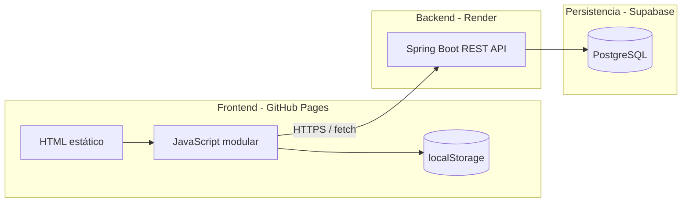

# Bienvenido - Plataforma de Gestión Aeronáutica

## Descripción general

**Bienvenido** es una aerolínea profesional que integra servicios de viaje, gestión de pasajeros y operaciones corporativas en una plataforma centralizada. Además de ofrecer vuelos, alojamientos y paquetes turísticos, incluye un **Panel de Administración** para monitoreo en tiempo real y gestión operativa.

---

## Arquitectura del sistema

El proyecto sigue una arquitectura **cliente-servidor** desplegada en la nube:



### URLs en producción

| Capa | Tecnología | URL |
| :--- | :--- | :--- |
| **Frontend** | GitHub Pages | https://didiernajas.github.io/FrontEnd-Aerolinea-Private/ |
| **Backend** | Render (Docker) | https://proyectovuelosspringboot.onrender.com |
| **Base de datos** | Supabase PostgreSQL | Conexión JDBC interna del backend |
| **Repo backend** | GitHub | https://github.com/didierNajas/proyectoVuelosSpringBoot |

### Frontend — capas (`js/`)

El frontend usa **ES Modules** con separación por responsabilidades (similar a MVC):

| Capa | Carpeta | Responsabilidad |
| :--- | :--- | :--- |
| **Config** | `config.js` | URL de la API según entorno (local vs producción) |
| **Services** | `services/` | Comunicación HTTP con el backend (`api.js`, `vuelosService.js`, etc.) |
| **Models** | `models/` | Objetos de dominio (`Vuelo`, `Pasajero`, `Reserva`) |
| **Views** | `views/` | Renderizado del panel admin en el DOM |
| **Controllers** | `controllers/` | Lógica de eventos y flujos de página |
| **Core** | `core/` | Utilidades, navbar, UI compartida |

Flujo de una petición al panel:

```
panel.html → panelController.js → vuelosService.js → api.js → Render API
                                              ↓
                                        vuelosView.js (DOM)
```

La autenticación del panel es **local** (`auth.js` + `localStorage`); los datos operativos (pasajeros, vuelos, reservas) vienen del backend.

### Backend — capas (Spring Boot)

| Capa | Paquete | Responsabilidad |
| :--- | :--- | :--- |
| **Controller** | `controllerEndPoint/` | Endpoints REST (`/vuelos`, `/pasajeros`, `/reservas`) |
| **Service** | `serviceMetodosEtc/` | Reglas de negocio |
| **Repository** | `repositoryComunicacion/` | Acceso a datos con JPA |
| **Model** | `modelEntidades/` | Entidades JPA |
| **DTO** | `DTO/` | Request/Response de la API |
| **Config** | `config/` | CORS para GitHub Pages y localhost |

---

## Panel de administración

### Métricas en tiempo real

| Métrica | Descripción |
| :--- | :--- |
| **Pasajeros** | Total registrados en la base de datos |
| **Vuelos** | Vuelos programados en el sistema |
| **Estado del sistema** | Conectividad con la API en Render |

### Funcionalidades del admin

- Monitoreo de **pasajeros**
- Gestión de **vuelos**
- Creación de **reservas**
- Verificación del estado de la **API**

---

## Servicios al cliente

- **Vuelos** — búsqueda, reserva y gestión de conexiones
- **Alojamientos** — opciones premium por destino
- **Paquetes** — experiencias integrales (vuelo + hotel + actividades)

---

## Requisitos

- **Java SDK:** 17+ o 21+
- **Spring Boot:** 3.x+
- **Base de datos:** PostgreSQL (Supabase)
- **Frontend:** navegador moderno con soporte ES Modules

---

## Seguridad

- Autenticación del panel con credenciales locales:
  - **Correo:** `admin@aerolinea.com`
  - **Password:** `Admin1234`
- CORS restringido a `localhost` y `https://didiernajas.github.io`
- Comunicación frontend ↔ backend exclusivamente por **HTTPS** en producción

---

## Configuración por entorno

`js/config.js` elige la URL de la API automáticamente:

| Entorno | URL de la API |
| :--- | :--- |
| Local (`localhost`) | `http://localhost:8080` |
| GitHub Pages | `https://proyectovuelosspringboot.onrender.com` |

También puedes sobreescribir en consola del navegador:

```js
localStorage.setItem('aerolinea-api-base-url', 'https://proyectovuelosspringboot.onrender.com');
```

---

## Despliegue

### Backend en Render

1. Conecta el repo `proyectoVuelosSpringBoot` como **Web Service** (runtime Docker).
2. Configura las variables de entorno de Supabase y CORS:

| Variable | Valor |
| :--- | :--- |
| `DATABASE_URL` | JDBC URL de Supabase con `?sslmode=require` |
| `DATABASE_USERNAME` | Usuario de Supabase |
| `DATABASE_PASSWORD` | Contraseña de Supabase |
| `JPA_DDL_AUTO` | `update` |
| `APP_CORS_ALLOWED_ORIGIN_PATTERNS` | `http://localhost:*,http://127.0.0.1:*,https://didiernajas.github.io` |

3. Verifica: https://proyectovuelosspringboot.onrender.com/vuelos

> En el plan gratuito de Render, el servicio puede tardar ~30–60 s en responder tras inactividad.

### Frontend en GitHub Pages

1. Push a `main` del repo `FrontEnd-Aerolinea-Private`.
2. **Settings → Pages → Source:** GitHub Actions.
3. El workflow `.github/workflows/pages.yml` publica el sitio automáticamente.

### Probar la conexión

1. Abre https://didiernajas.github.io/FrontEnd-Aerolinea-Private/
2. Inicia sesión como admin.
3. Entra al **Panel** y confirma que carguen pasajeros y vuelos.

Si aparece "Sin conexión":
- Despierta el backend abriendo `/vuelos` en Render.
- Revisa que CORS incluya `https://didiernajas.github.io`.
- Confirma que `PRODUCTION_API_BASE_URL` en `js/config.js` sea correcta.
